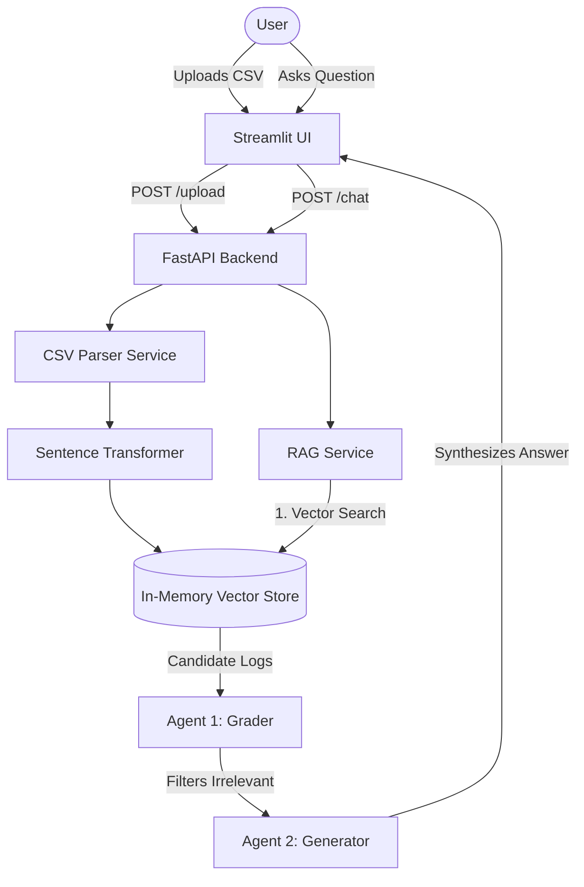

<div align="center">

# 📊 AI-Assisted Log & Metrics Explorer

A modern, full-stack application for analyzing system logs, visualizing metrics, and chatting with your data using local **Agentic AI**.

[](https://fastapi.tiangolo.com)
[](https://streamlit.io)
[](https://www.python.org/)
[](https://ollama.com/)

</div>

---

## ✨ Key Features

- **Upload & Parse**: Ingest CSV log files instantly.
- **Interactive Dashboard**: Visualize error rates, warning trends, and log distribution over time.
- **RAG Chatbot**: Chat naturally with your logs using Retrieval-Augmented Generation.
- **Agentic Workflow**: Features a "Relevance Grader" agent that validates search results to reduce LLM hallucinations.
- **Local AI First**: Fully private execution using **Ollama** (Llama 2, Llama 3.2, etc.) and `sentence-transformers`.
- **Premium UI**: Polished interface with custom CSS, toast notifications, and responsive design.

---

## 🏗️ Architecture

The Log Explorer leverages a multi-agent RAG workflow. Instead of blindly sending searched logs to the LLM, a **Grader Agent** intercepts and validates the relevance of the retrieved logs first.



---

## 🛠️ Tech Stack

- **Backend**: FastAPI, Uvicorn, Pydantic, Python `logging`
- **Frontend**: Streamlit, Pandas, Plotly (via Streamlit charts)
- **AI / ML**: `sentence-transformers` (`all-MiniLM-L6-v2`), Ollama
- **Storage**: In-Memory Data Structures (Vector embeddings & Log entries)

---

## 🚀 Getting Started

### Prerequisites

- **Python 3.10+**
- **[Ollama](https://ollama.com/)** installed and running on your local machine.
- Verify you have pulled a model in Ollama. For example: `ollama pull llama3.2:1b`

### 1. Clone & Install
```bash
git clone https://github.com/yourusername/log-explorer.git
cd log-explorer
python -m venv venv
source venv/bin/activate  # On Windows: venv\Scripts\activate
pip install -r requirements.txt
```

### 2. Configure Environment
Create a `.env` file in the root directory (or inside `backend/`):
```env
# API Configuration
PORT=8000
HOST=0.0.0.0

# Ollama Configuration
OLLAMA_BASE_URL=http://localhost:11434
OLLAMA_MODEL=llama3.2:1b
RAG_MODEL_NAME=all-MiniLM-L6-v2
```

### 3. Run the Application
You will need three terminal tabs/windows:

**Terminal 1 (AI Service)**
```bash
ollama serve
```

**Terminal 2 (Backend)**
```bash
python backend/main.py
```

**Terminal 3 (Frontend)**
```bash
streamlit run frontend/app.py
```

### 4. Explore!
Open your browser to `http://localhost:8501`. Upload the provided `sample_logs.csv` to test the dashboard and chat functionalities.

---

## 📈 Development Journey & Agentic Evolution

This project evolved from a simple log viewer to an intelligent, agentic system.

| Stage | Focus | Description |
| :--- | :--- | :--- |
| **1. Foundation** | Backend API | Created endpoints for file upload, filtering, and summary using Pydantic validation. |
| **2. Visualization**| UI Dashboard | Built a Streamlit interface with metric cards and time-series line charts. |
| **3. Basic RAG** | Vector Search | Integrated `sentence-transformers` for local semantic search indexing. |
| **4. AI Chat** | Ollama Link | Connected a local LLM to generate natural language answers from log context. |
| **5. Accuracy** | **Agentic RAG** | **Crucial Upgrade**: Added a "Grader Agent" loop. The LLM was getting distracted by irrelevant logs. We implemented a step where an AI "Judge" evaluates if a log is actually relevant *before* generation. |
| **6. Polish** | Robustness | Replaced raw exceptions with logging, added `.gitignore`, configured toasts over static sidebars, and hardened Ollama API timeouts. |

## 🔮 Future Work

While this application proves out the Agentic RAG concept, the following areas are designated for future enhancement:

- **Persistent Storage**: Migration from in-memory arrays to a persistent Vector DB (e.g., ChromaDB, Qdrant) and a Log DB (e.g., PostgreSQL or Elasticsearch).
- **Streaming LLM Responses**: Implement Server-Sent Events (SSE) in FastAPI to stream Ollama tokens directly to the Streamlit UI.
- **Authentication**: Add JWT-based auth to secure endpoints and separate user workspaces.
- **Dockerization**: Containerize both the frontend and backend using `docker-compose`.

---

> **Note**: This is a portfolio/MVP project demonstrating FastAPI, Streamlit, and Local AI architecture. Used in an enterprise context, the logging mechanisms would be replaced by agents running against centralized services (Datadog, Splunk, etc.).
